<h1 align="center">
   RedStore (Em Desenvolvimento!)
</h1>

 

## :camera: Demonstração

<h2 align="center">
   Home
</h2>

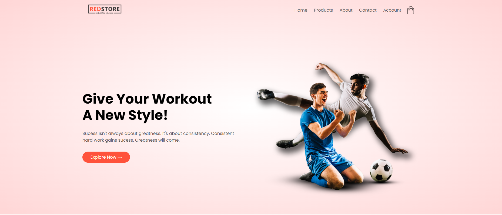

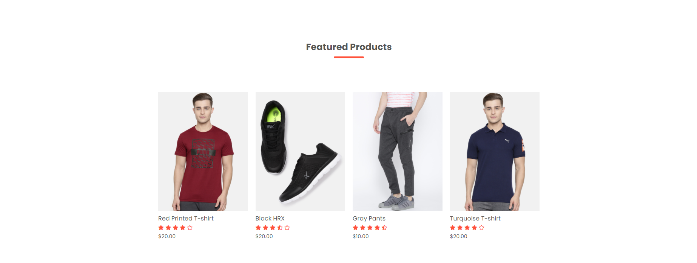
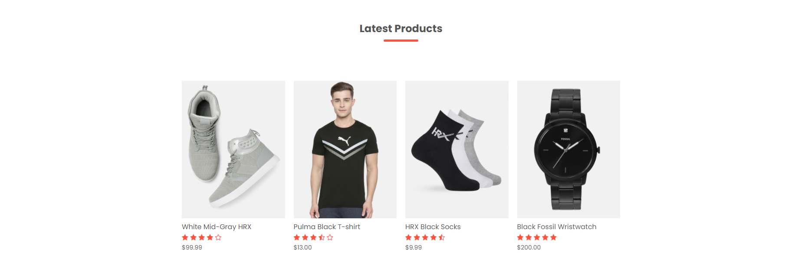
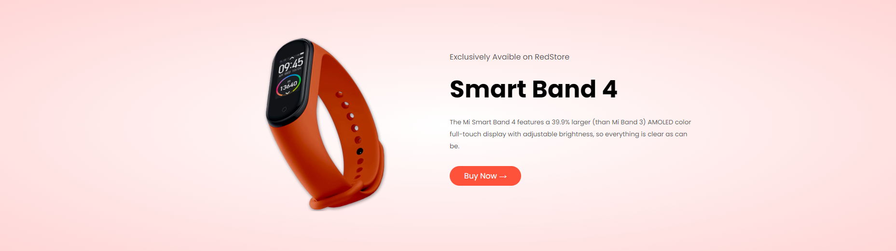
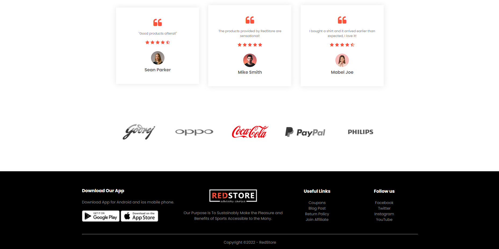

<h2 align="center">
   Todos Produtos
</h2>

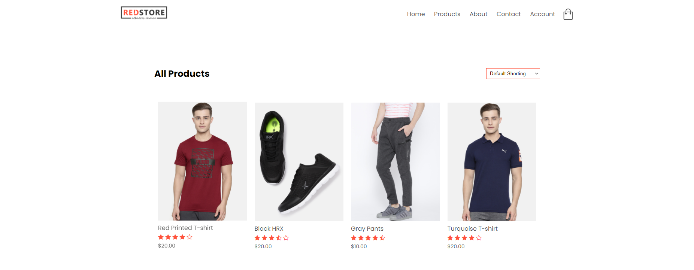
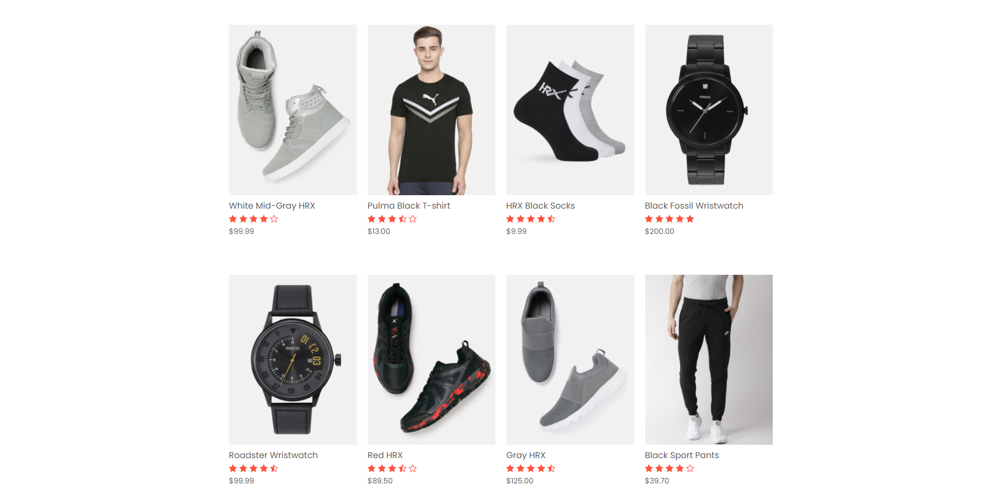
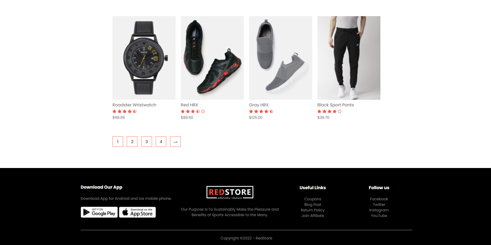

<h2 align="center">
   Detalhes do Produto
</h2>

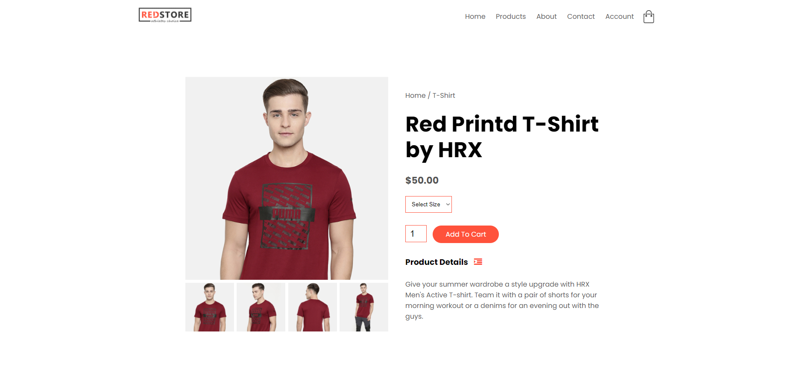

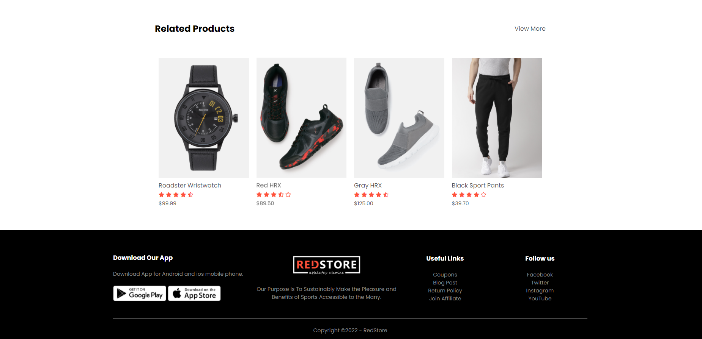

<h2 align="center">
   Carrinho
</h2>

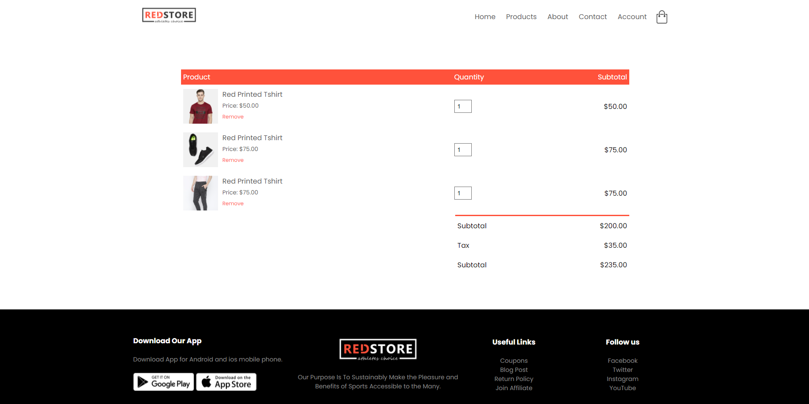

## :rocket: Tecnologias

Esse projeto foi desenvolvido com as seguintes tecnologias:

✔️Bootstrap

✔️HTML5

✔️CSS3

## 💻 Projeto

- Acesse a aplicação pelo link:
> - [Home](https://redstore-plb.netlify.app)
